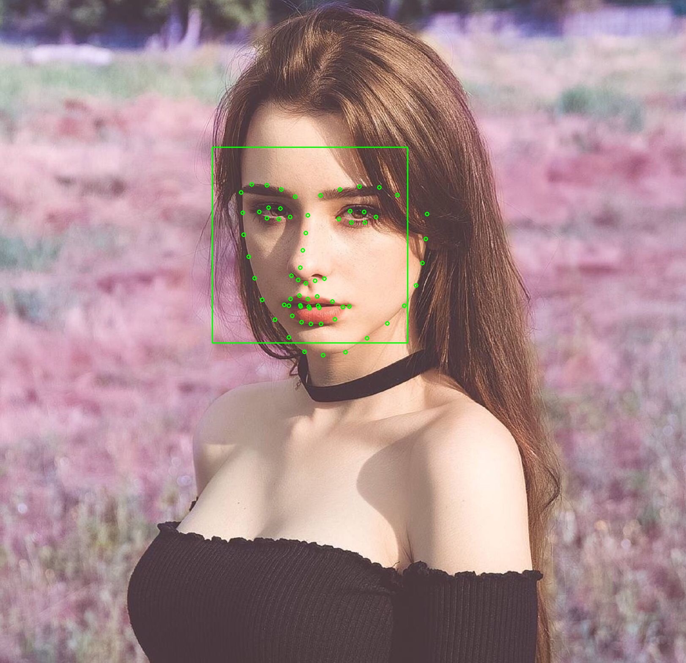

credit to [DashaTaran](https://www.instagram.com/taaarannn/)

## Description

A very basic collection of Python3 scripts/wrappers to handle dlib/opencv usages.

## Versions

### 20180810

- added first version.

## Usage

0. install OpenCV, Dlib, (numpy if needed) before use. be aware that Python is rather slower than C++ implementation, hence just use it in demo version.
	
	- for OpenCV, just pip install opencv-python

	- for Dlib, install CMake first, then run pip install dlib (newer 19.1x version do not need *Boost* lib dependency anymore). or download pre-build .whl version from official sites

1. install any needed dependencies such as FFmpeg, openh264.dll, DivX CODEC, etc.

2. run the scripts! ;-)

## Keywords

ML | tool | dlib | opencv | camera | menpo | face recognition | 

